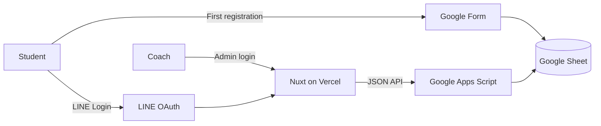

# Bingji

[Production](https://bingji-delta.vercel.app)

Bingji is an MVP built to validate whether LINE Login, Google Forms, and Google Sheets can support a real course registration and attendance workflow with minimal infrastructure.

The project is designed for skating classes in Taiwan, where coaches and students already use LINE for class communication. Students use their LINE account instead of creating another account and password.

## Features

- Students sign in with LINE, register for open classes, and review attendance history.
- New students submit their information through Google Form.
- Coaches manage classes and confirm attendance from a separate admin interface.
- Lessons are deducted only after attendance is confirmed.

## Architecture



Google Form collects student information. One spreadsheet stores form responses, LINE account mappings, courses, and registrations in separate tabs. Apps Script provides the API and keeps credentials outside the frontend.

**Stack:** Nuxt 4, Vue 3, TypeScript, Google Apps Script, Google Sheets, Google Forms, LINE Login, Vitest, and Playwright.

## Design Trade-offs

| Decision | Benefit | Limitation |
| --- | --- | --- |
| LINE Login | Matches how students already communicate | Depends on LINE channel and callback configuration |
| Google Sheets storage | Low operating cost and familiar to the coach | Higher, less predictable latency than a database |
| Apps Script backend | Direct Sheet integration and simple deployment | Limited runtime control and observability |
| Shared coach account | Sufficient for a single-coach MVP | No individual audit trail |

The backend validates OAuth `state` and OpenID Connect `nonce`, issues application session tokens, and uses Apps Script locks to protect concurrent writes. Request diagnostics separate browser, network, backend, and Sheet timings for performance investigation.

## Production

The deployed application uses the production LINE Login channel and data source:

https://bingji-delta.vercel.app

A LINE account is required. The application is connected to real production data rather than a disposable demo environment.

## Development and Testing

```bash
npm install
npm test
```

The non-live E2E suite runs against a production build and stubs LINE and Apps Script, so it does not require private accounts or credentials.

```bash
npm run test:unit
npm run test:component
npm run test:e2e
npm run test:e2e:live
```

`npm run dev` starts the frontend locally, but the complete LINE Login flow returns to the configured production callback URL.

## Limitations

- Apps Script and Google Sheets introduce variable request latency.
- The shared coach account is intended for a single-coach workflow.
- Full LINE Login verification depends on the production callback and external LINE configuration.

## Documentation

- [Self-hosting](docs/self-hosting.md)
- [LINE Login flow](docs/line-login-flow.md)
- [Test inventory](docs/test-inventory.html)
