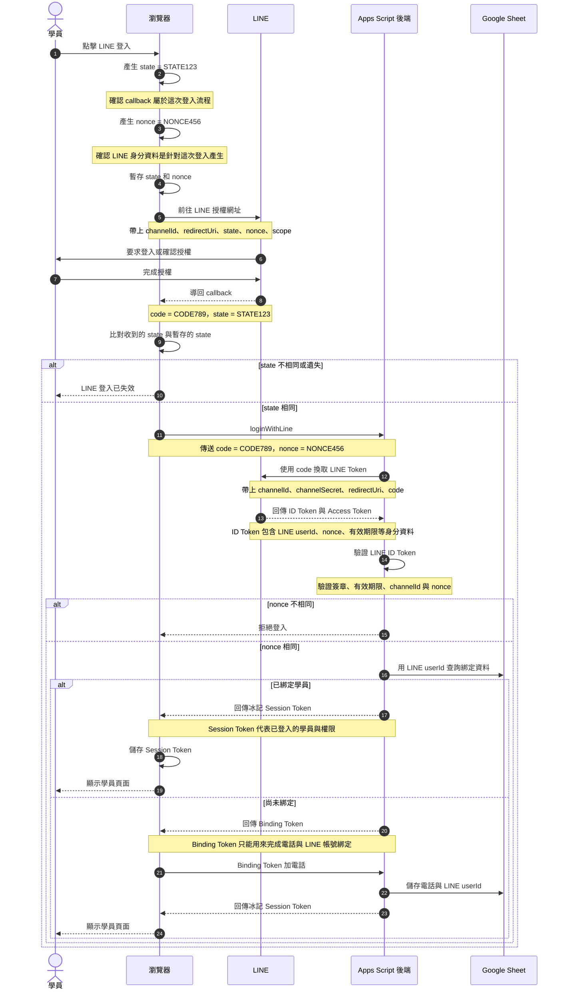

# LINE 登入流程

## 變數用途

| 變數 | 產生者 | 使用階段 | 目的 |
| --- | --- | --- | --- |
| `state` | 前端 | LINE callback 回來時 | 確認 callback 對應這次登入 |
| `nonce` | 前端 | 後端驗證 LINE ID Token 時 | 防止舊身分資料被重播 |
| `code` | LINE | 後端向 LINE 換 Token | 一次性、短效的兌換碼 |
| LINE ID Token | LINE | 後端驗證 LINE 身分 | 證明使用者的 LINE 身分 |
| Binding Token | 冰記後端 | 第一次綁定電話 | 暫時允許完成帳號綁定 |
| 冰記 Session Token | 冰記後端 | 登入後呼叫冰記功能 | 代表冰記登入身分與權限 |

`state`、`nonce`、`code` 都是登入過程中的臨時資料；真正讓使用者持續使用冰記的是最後取得的冰記 Session Token。
